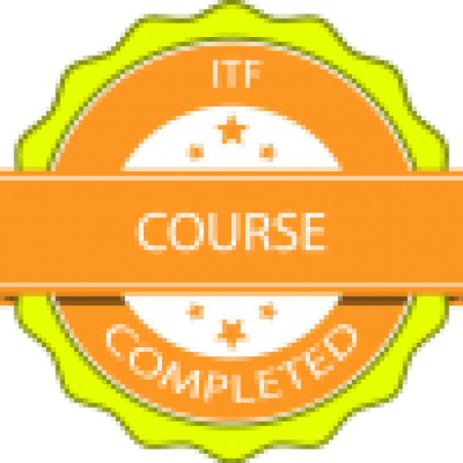
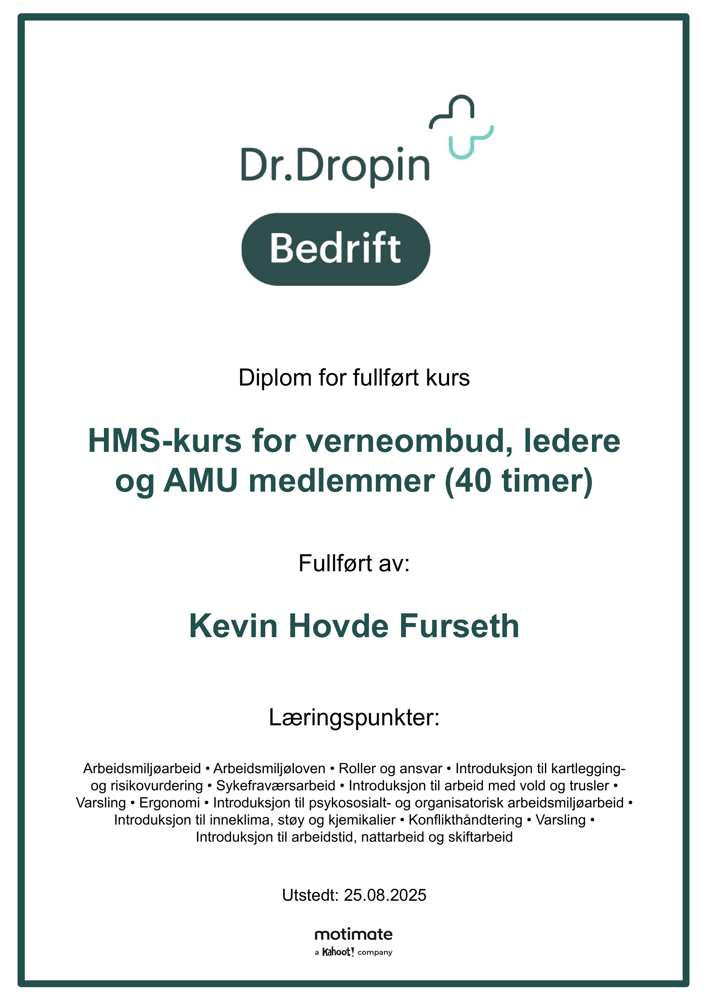

# 👋 Hi, I'm Kevin Furseth  

🎓 Student at **Noroff – Network & IT Security (2025–2027)**  
💻 Building skills in IT, security, networking, and system administration  
📂 This portfolio documents my progress, projects, and certifications along the way  

---

## 🧰 Tech & Tools  

  
  
  
  
  
  
  

---

## 📜 Certifications & Badges  

- **ITF Complete** (Noroff, 2025)  
    
   
  🔗 [View Badge](ITF_Complete.png)  
   
  *Covers ITF Module 1–4: Introduction to IT, Networking Basics, Security Fundamentals,  
  Task Planning, Report Writing, Research & Referencing, Working with AI, and more.*  

---

- **HSE Course – 40 hours** (2025)  
    
   
  🔗 [View Certificate](HMS-sertifikat.pdf)  
   
  *Covers Working Environment Act, risk assessment, reporting, conflict management,  
  ergonomics, psychosocial work environment, and occupational safety practices.*  

---

## 🛠️ Projects  

- **[Flytify](https://github.com/Flytify)** – AI-powered travel planner  
  *Node.js backend, React frontend, API integrations (flights + hotels),  
  deployed with CapRover.*  

- **Portfolio** – This repo showcasing my certifications, studies, and case studies.  

---

## 📚 Current Focus  

- Networking & System Administration  
- IT Security Fundamentals  
- Cloud & Virtualization  
- Building a strong professional portfolio  

---

## 🌐 Connect  

- GitHub: [KevinFurseth](https://github.com/KevinFurseth)  
- Email: kev@furz.no  

---
