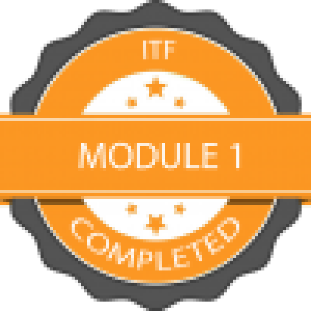

# 👋 Hi, I'm Kevin Furseth  

I am a student at **Noroff – Network & IT Security (2025–2027)**.  
This portfolio documents my progress throughout my studies, projects I build along the way, and certifications I complete.  

---

## 🎓 Certifications & Badges
- ✅ **ITF Module 1 (Noroff)** – 25.08.2025  
  First module completed in IT Fundamentals.  
  

- ✅ **HSE course for safety representatives, leaders, and AMU members (40 hours)** – 25.08.2025  
  Focus on the Working Environment Act, risk assessment, reporting, conflict management, ergonomics, and psychosocial work environment.  
  📄 [View certificate](HMS-sertifikat.pdf)

---

## 🛠️ Projects
Here I will share lab assignments, small tools, and security-related projects I develop:  

- **Coming soon!**

---

## 📚 Currently learning
- Networking and IT Security  
- Virtualization and cloud technology  
- Basic programming and automation  

---

## 📫 Contact
- [LinkedIn](https://www.linkedin.com/) (coming soon)  
- [GitHub](https://github.com/kevinfurseth)  
