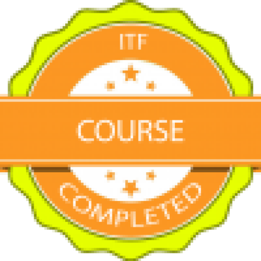
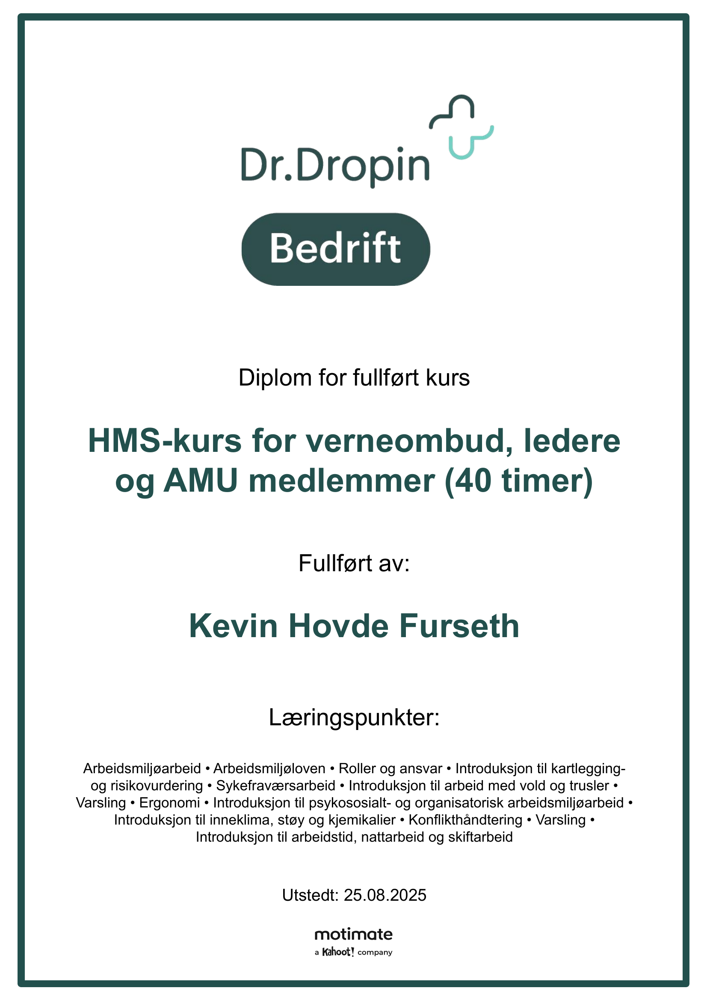

# Hei, jeg er Kevin Furseth

Jeg bygger en portfolio som kombinerer **IT-sikkerhet, infrastruktur og produktnær webutvikling**. Målet mitt er å utvikle prosjekter som både viser teknisk forståelse og evnen til å bygge løsninger som faktisk føles nyttige, gjennomførte og klare til å presenteres.

Jeg studerer **Network & IT Security ved Noroff (2025–2027)**, og bruker denne porteføljen til å samle prosjekter, sertifiseringer og praktisk arbeid underveis.

---

## Om denne porteføljen

Denne repoen fungerer som et samlingspunkt for:

- utvalgte prosjekter jeg har bygget eller arbeidet med
- case studies og produktarbeid
- sertifiseringer og kurs
- utviklingen min innen sikkerhet, infrastruktur og moderne webteknologi

Det viktigste for meg er ikke bare å “lage noe som virker”, men å vise at jeg kan ta en idé videre til noe som er strukturert, troverdig og presentabelt.

---

## Utvalgte prosjekter

### [QuoteCraft](https://github.com/KevinFurseth/quotecraft)

Et gjennomført B2B-verktøy for tilbudsgenerering med fokus på arbeidsflyt, presentasjon og AI-assistert innhold.

- strukturert arbeidsområde for å bygge tilbud
- dynamiske linjeposter med automatisk summering
- live forhåndsvisning av kundevendt resultat
- AI-generert tilbudstekst via server-side OpenAI-integrasjon
- PDF-eksport, tilbudsoversikt, statusflyt, språk- og valutastøtte

### [enterprise-infrastructure-lab](https://github.com/KevinFurseth/enterprise-infrastructure-lab)

Praktisk infrastrukturlab med fokus på enterprise-miljøer, nettverk, systemdrift, sikkerhet og produksjonsnære oppsett.

### [smb-security-audit](https://github.com/KevinFurseth/smb-security-audit)

Sikkerhetsgjennomgang rettet mot SMB-miljøer, med fokus på risikovurdering, svakhetsanalyse og konkrete forbedringstiltak.

### [Flytify-case-study](https://github.com/KevinFurseth/Flytify-case-study)

Produkt- og UX-case study som viser hvordan arbeidsflyt, struktur og presentasjon kan løfte et digitalt konsept fra idé til tydeligere løsning.

### [AINM](https://github.com/KevinFurseth/AINM)

AI-relatert prosjekt med fokus på praktisk bruk av språkmodeller, arbeidsflyt og produktnære implementasjoner.

---

## Teknologi og verktøy

---

## Hva jeg jobber med nå

Jeg er spesielt opptatt av å utvikle meg videre innen:

- nettverk og systemadministrasjon
- IT-sikkerhet og praktisk sikkerhetsarbeid
- sky, virtualisering og infrastruktur
- moderne frontend med tydelig produktfokus
- AI-integrasjon i faktiske brukerflyter

---

## Sertifiseringer og kurs

### ITF Complete (Noroff, 2025)

[Se badge](ITF_Complete.png)

Dekker blant annet:

- introduksjon til IT
- grunnleggende nettverk
- sikkerhetsfundamenter
- planlegging, dokumentasjon og rapportering
- research, kildebruk og arbeid med AI

---

### HMS-kurs – 40 timer (2025)

[Se sertifikat](HMS-sertifikat.pdf)

Dekker blant annet:

- arbeidsmiljøloven
- risikovurdering og rapportering
- ergonomi og psykososialt arbeidsmiljø
- konflikthåndtering
- HMS-praksis og sikkerhet i arbeidshverdagen

---

## Hva denne porteføljen skal vise

Jeg ønsker at denne porteføljen skal gjøre det tydelig at jeg:

- bygger prosjekter med faktisk struktur og gjennomføring
- kan jobbe både med teknisk dybde og brukerrettet presentasjon
- er opptatt av kvalitet, ikke bare funksjonalitet
- lærer raskt og liker å gå fra idé til ferdig løsning
- kombinerer sikkerhet, infrastruktur og produktutvikling i samme profil

For meg er det viktig at reposene ikke bare viser kode, men også retning, ambisjon og evnen til å fullføre noe ordentlig.

---

## Kontakt

- GitHub: [KevinFurseth](https://github.com/KevinFurseth)
- E-post: [kev@furz.no](mailto:kev@furz.no)

---

Takk for at du ser på porteføljen min.
